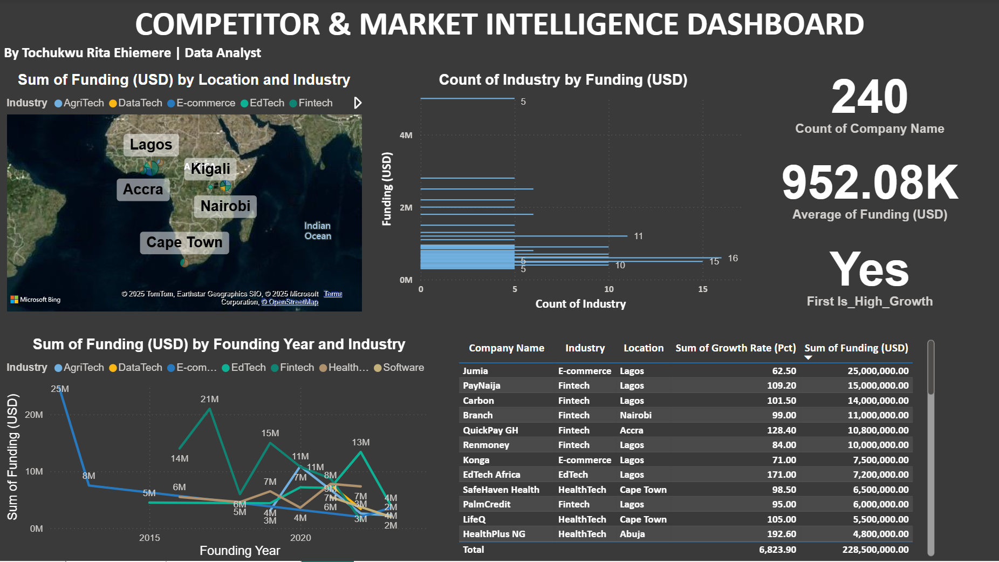

# Competitor & Market Intelligence Dashboard  
**End-to-End Data Analysis | Python • SQL • Power BI • Strategic Insights**

By **Tochukwu Rita Ehiemere**  
Email: ehiemeretochukwu@gmail.com | Lagos, Nigeria  
[https://www.linkedin.com/in/tochi-ehiemere3](#) 

## Project Overview
As a **Data Analyst** with experience at **KloudOpp Limited** and **DaHel Consultants**, I specialize in transforming raw data into **actionable business insights**. In this project, I demonstrated a full data workflow:
- **Data cleaning & transformation** using **Python (Pandas)**
- **Database design & SQL analysis** using **MySQL**
- **Dashboard development** in **Power BI** (interactive visuals, KPIs, maps).
- **Strategic insights** for market intelligence and partnership opportunities.

Inspired by my work improving **marketing efficiency by 15%** at KloudOpp, this project identifies high-growth startups, funding trends, and strategic gaps just like real-world stakeholder reporting.

## Dataset
- **Source**: Simulated dataset based on African tech startup trends
- **Fields**: `Company Name`, `Industry`, `Location`, `Funding (USD)`, `Employees`, `Founding Year`, `Growth Rate (Pct)`, `Competitors`, `etc`
- **Cleaning Process**:
  - Cleaned and standardized 240 startup records
  - Created `Funding per Employee` and `High Growth` flags
  - Handled missing values and ensured data integrity
- **Output**: `african_startups.csv`

## Tools & Skills Used
- **Python**: Pandas for data cleaning and preprocessing
- **SQL**: MySQL for database creation and querying
- **Power BI**: Interactive dashboard with maps, KPIs, and trend analysis
- **Data Analysis**: Trend analysis, competitor benchmarking, geospatial mapping
- **Business Intelligence**: Translating data into strategic insights for non-technical stakeholders

## Dashboard Preview

*Interactive Power BI dashboard showing startup funding, growth trends, and regional performance.*

## Key Insights
1. **EdTech is a high-growth, low-competition sector**: Ideal for investment and partnerships.
2. **Nigerian startups receive the highest funding**, but **Kenyan startups show faster growth rates**.
3. **"EdTech Africa" and "LearnFast NG"** are top-performing startups with strong growth potential.
4. **Fintech is oversaturated**: I recommend diversifying into **AgriTech and HealthTech**.

> These insights mirror real-world impact I delivered at **KloudOpp**, where strategic analysis improved marketing efficiency by **15%** and enabled new business lines.

## How to Use This Project
1. Open `Competitor_Intelligence_Dashboard.pbix` in Power BI Desktop
2. Explore SQL queries in `queries.sql`
3. Review Python cleaning code in `clean_startup_data.py`
4. View analysis in the `startups` table

## Let’s Connect!
I’m a data analyst passionate about turning raw data into business value. If you’re hiring or want to collaborate, I’d love to hear from you.

Email: ehiemeretochUKwu@gmail.com  
LinkedIn: [https://www.linkedin.com/in/tochi-ehiemere3]  
